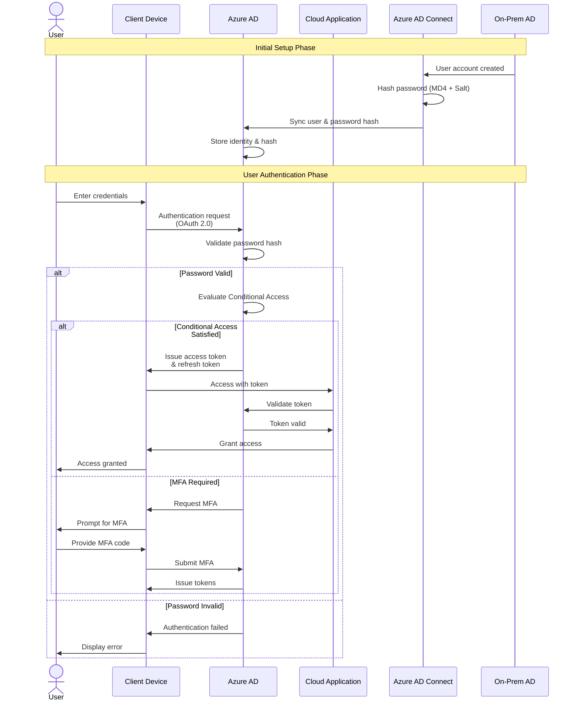
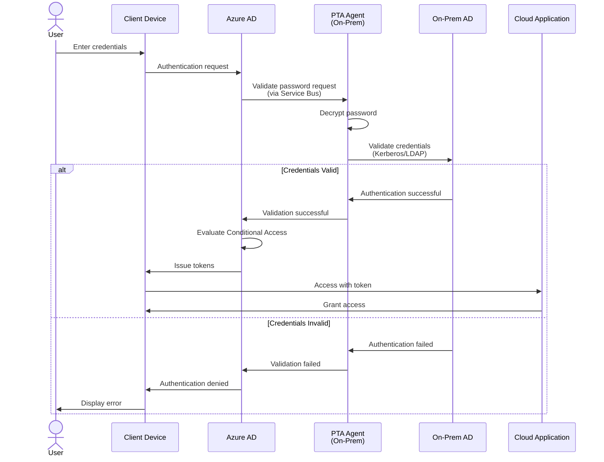
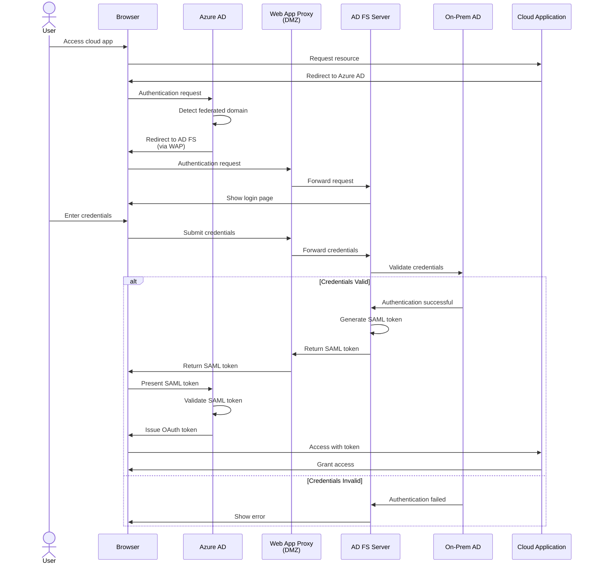
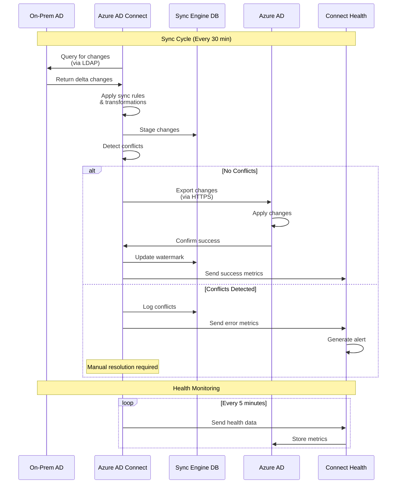
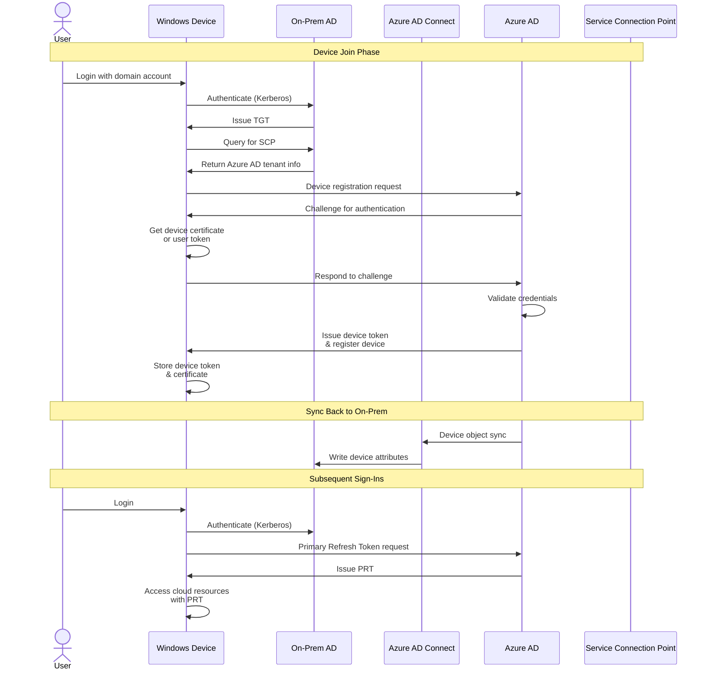
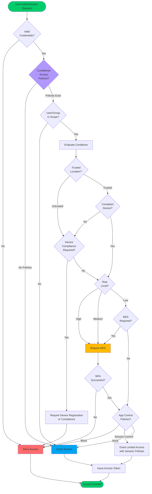

# Azure AD and On-Premises AD Hybrid Architecture - Enhanced Version

## Overview

This document provides a comprehensive view of a hybrid Active Directory environment with Azure AD (Entra ID), including detailed architecture, logical flow, and workflow diagrams.

---

## 1. Enhanced Architecture Diagram

This enhanced architecture includes components that were simplified in the basic version:

```mermaid
graph TB
    subgraph "Azure Cloud"
        AAD["Azure AD (Entra ID)<br/>Cloud Identity Platform"]
        AADUsers["Cloud Users<br/>Synced from On-Prem"]
        AADConnect["Azure AD Connect Service<br/>in Cloud"]
        AADConnectHealth["Azure AD Connect Health<br/>Monitoring Service"]
        AADAppProxy["Azure AD Application Proxy<br/>Secure Remote Access"]
        ConditionalAccess["Conditional Access<br/>Policies & MFA"]
        AADDomainServices["Azure AD Domain Services<br/>(Optional)"]
        
        AAD --> AADUsers
        AAD --> ConditionalAccess
        AAD --> AADAppProxy
        AAD --> AADDomainServices
        AADConnect --> AAD
        AADConnectHealth --> AAD
    end
    
    subgraph "DMZ / Perimeter Network"
        WAP["Web Application Proxy<br/>Reverse Proxy"]
        ADFS["AD FS Server<br/>Federation Services"]
        NPS["Network Policy Server<br/>RADIUS for MFA"]
        
        WAP --> ADFS
        ADFS --> NPS
    end
    
    subgraph "On-Premises Environment"
        subgraph "Site 1 - Primary Data Center"
            DC1["Primary Domain Controller<br/>AD DS + DNS + GC"]
            DC1Backup["Backup Domain Controller<br/>AD DS + DNS + GC"]
            Site1Users["Site 1 Users<br/>& Computers"]
            Site1RODC["Read-Only DC<br/>(Branch Cache)"]
            CA["Certificate Authority<br/>PKI Infrastructure"]
            DNS1["DNS Servers<br/>Internal Resolution"]
            DHCP1["DHCP Servers<br/>IP Management"]
            FileServer1["File Servers<br/>with DFS"]
            GPO1["Group Policy<br/>Management"]
            
            DC1 --> Site1Users
            DC1 <--> DC1Backup
            DC1 -.Replication.-> Site1RODC
            DC1 --> GPO1
            DC1 --> DNS1
            CA --> DC1
        end
        
        subgraph "Site 2 - Regional Office"
            DC2["Domain Controller<br/>AD DS + DNS + GC"]
            Site2Users["Site 2 Users<br/>& Computers"]
            Site2RODC["Read-Only DC<br/>(Optional)"]
            DNS2["DNS Server<br/>Internal Resolution"]
            DHCP2["DHCP Server<br/>IP Management"]
            FileServer2["File Server<br/>with DFS"]
            
            DC2 --> Site2Users
            DC2 -.Replication.-> Site2RODC
            DC2 --> DNS2
        end
        
        subgraph "Site 3 - Branch Office"
            DC3["Domain Controller<br/>AD DS + DNS + GC"]
            Site3Users["Site 3 Users<br/>& Computers"]
            Site3RODC["Read-Only DC<br/>(Optional)"]
            BranchCache["BranchCache Server<br/>Content Optimization"]
            
            DC3 --> Site3Users
            DC3 -.Replication.-> Site3RODC
            DC3 --> BranchCache
        end
        
        subgraph "Sync Infrastructure"
            SyncServer["Azure AD Connect Server<br/>Primary Sync Engine"]
            SyncStaging["Azure AD Connect Staging<br/>Standby Server"]
            HealthAgent["Connect Health Agent<br/>Monitoring & Diagnostics"]
            
            SyncServer -.Standby Mode.-> SyncStaging
            SyncServer --> HealthAgent
        end
        
        subgraph "Management & Monitoring"
            SCOM["System Center Operations Manager<br/>Infrastructure Monitoring"]
            BackupServer["Backup Server<br/>AD System State Backup"]
        end
    end
    
    subgraph "Client Access"
        OnPremClients["On-Premises Clients<br/>Domain Joined (Hybrid)"]
        CloudClients["Cloud/Remote Clients<br/>Azure AD Joined"]
        MobileDevices["Mobile Devices<br/>Intune Managed"]
        RemoteWorkers["Remote Workers<br/>VPN Connected"]
    end
    
    %% Internet Boundary
    Internet["Internet"]
    
    %% Core AD Replication
    DC1 <==AD Replication==> DC2
    DC2 <==AD Replication==> DC3
    DC3 <==AD Replication==> DC1
    DC1Backup <==AD Replication==> DC2
    DC1Backup <==AD Replication==> DC3
    
    %% Sync to Azure AD
    SyncServer -->|Reads User/Group Data| DC1
    SyncServer -->|Password Hash Sync<br/>or Pass-through Auth| AADConnect
    HealthAgent -->|Health Metrics| AADConnectHealth
    
    %% Federation Flow
    ADFS -->|LDAP Auth| DC1
    WAP <-->|HTTPS 443| Internet
    
    %% Client Authentication Paths
    OnPremClients -->|Kerberos/NTLM| DC1
    OnPremClients -->|Kerberos/NTLM| DC2
    OnPremClients -->|Kerberos/NTLM| DC3
    
    CloudClients <-->|OAuth 2.0/SAML| Internet
    Internet <-->|HTTPS| AAD
    MobileDevices <-->|HTTPS/OAuth| Internet
    RemoteWorkers <-->|VPN/HTTPS| WAP
    
    %% App Proxy Connections
    AADAppProxy <-.Connector.-> FileServer1
    AADAppProxy <-.Connector.-> FileServer2
    
    %% Monitoring Connections
    SCOM -.Monitors.-> DC1
    SCOM -.Monitors.-> DC2
    SCOM -.Monitors.-> DC3
    SCOM -.Monitors.-> SyncServer
    
    BackupServer -.Backup.-> DC1
    BackupServer -.Backup.-> DC1Backup
    
    %% Styling
    classDef azureClass fill:#0078D4,stroke:#004578,stroke-width:2px,color:#fff
    classDef dcClass fill:#00A4EF,stroke:#006BA6,stroke-width:2px,color:#fff
    classDef userClass fill:#50E6FF,stroke:#00B7C3,stroke-width:2px,color:#000
    classDef syncClass fill:#FFB900,stroke:#D39400,stroke-width:2px,color:#000
    classDef clientClass fill:#00CC6A,stroke:#008A4C,stroke-width:2px,color:#fff
    classDef dmzClass fill:#FF6B6B,stroke:#C92A2A,stroke-width:2px,color:#fff
    classDef mgmtClass fill:#B197FC,stroke:#7950F2,stroke-width:2px,color:#fff
    classDef infraClass fill:#74C0FC,stroke:#339AF0,stroke-width:2px,color:#000
    
    class AAD,AADUsers,AADConnect,AADConnectHealth,AADAppProxy,ConditionalAccess,AADDomainServices azureClass
    class DC1,DC2,DC3,DC1Backup,Site1RODC,Site2RODC,Site3RODC dcClass
    class Site1Users,Site2Users,Site3Users userClass
    class SyncServer,SyncStaging,HealthAgent syncClass
    class OnPremClients,CloudClients,MobileDevices,RemoteWorkers clientClass
    class WAP,ADFS,NPS dmzClass
    class SCOM,BackupServer mgmtClass
    class CA,DNS1,DNS2,DHCP1,DHCP2,FileServer1,FileServer2,BranchCache,GPO1 infraClass
```

### Enhanced Components Added:

#### Azure Cloud
- **Azure AD Connect Health**: Monitors sync health and provides alerts
- **Azure AD Application Proxy**: Secure remote access to on-prem applications
- **Conditional Access Policies**: Advanced security with MFA integration
- **Azure AD Domain Services**: Optional managed domain services

#### DMZ / Perimeter
- **Web Application Proxy (WAP)**: Reverse proxy for external access
- **AD FS**: Federation services for SSO and claims-based authentication
- **Network Policy Server (NPS)**: RADIUS server for MFA integration

#### On-Premises Infrastructure
- **Backup Domain Controllers**: High availability at primary site
- **Certificate Authority**: PKI infrastructure for certificates
- **DNS Servers**: Internal name resolution per site
- **DHCP Servers**: IP address management
- **File Servers with DFS**: Distributed file system
- **Group Policy Management**: Centralized configuration management
- **BranchCache**: WAN optimization for branch offices

#### Sync Infrastructure
- **Staging Server**: Standby Azure AD Connect server for failover
- **Health Agent**: Local monitoring component

#### Management & Monitoring
- **System Center Operations Manager**: Enterprise monitoring
- **Backup Server**: System state and AD backup management

---

## 2. Logical Diagram

This diagram shows the logical relationships and authentication flows:

```mermaid
graph TB
    subgraph "Identity Layer"
        CloudIdentity["Cloud Identity Store<br/>(Azure AD)"]
        OnPremIdentity["On-Premises Identity Store<br/>(Active Directory)"]
        
        OnPremIdentity <-->|Bidirectional Sync<br/>Users, Groups, Passwords| CloudIdentity
    end
    
    subgraph "Authentication Layer"
        CloudAuth["Cloud Authentication<br/>(OAuth 2.0, SAML, OpenID)"]
        HybridAuth["Hybrid Authentication<br/>(PHS, PTA, Federation)"]
        OnPremAuth["On-Premises Authentication<br/>(Kerberos, NTLM)"]
        
        CloudAuth -->|Authenticates Against| CloudIdentity
        HybridAuth -->|Validates With| OnPremIdentity
        HybridAuth -->|Issues Tokens From| CloudIdentity
        OnPremAuth -->|Authenticates Against| OnPremIdentity
    end
    
    subgraph "Authorization Layer"
        CloudAuthorization["Cloud Authorization<br/>(Azure RBAC, Conditional Access)"]
        OnPremAuthorization["On-Premises Authorization<br/>(ACLs, Group Policy)"]
        
        CloudAuthorization -->|Uses Identity From| CloudIdentity
        OnPremAuthorization -->|Uses Identity From| OnPremIdentity
    end
    
    subgraph "Resource Layer"
        CloudResources["Cloud Resources<br/>(Microsoft 365, SaaS Apps)"]
        HybridResources["Hybrid Resources<br/>(Via App Proxy, VPN)"]
        OnPremResources["On-Premises Resources<br/>(File Shares, Internal Apps)"]
        
        CloudResources -->|Access Granted By| CloudAuthorization
        HybridResources -->|Access Granted By| CloudAuthorization
        HybridResources -->|Backend Authorization| OnPremAuthorization
        OnPremResources -->|Access Granted By| OnPremAuthorization
    end
    
    subgraph "Client Layer"
        ModernClients["Modern Clients<br/>(Azure AD Joined)"]
        HybridClients["Hybrid Clients<br/>(Hybrid AD Joined)"]
        LegacyClients["Legacy Clients<br/>(Domain Joined)"]
        
        ModernClients -->|Authenticates Via| CloudAuth
        HybridClients -->|Authenticates Via| HybridAuth
        HybridClients -->|Can Use| OnPremAuth
        LegacyClients -->|Authenticates Via| OnPremAuth
    end
    
    subgraph "Management Layer"
        CloudManagement["Cloud Management<br/>(Intune, Azure Portal)"]
        HybridManagement["Hybrid Management<br/>(Co-Management)"]
        OnPremManagement["On-Premises Management<br/>(GPO, SCCM)"]
        
        CloudManagement -->|Manages| ModernClients
        HybridManagement -->|Manages| HybridClients
        OnPremManagement -->|Manages| LegacyClients
        OnPremManagement -->|Manages| OnPremResources
    end
    
    subgraph "Security & Compliance Layer"
        ThreatProtection["Threat Protection<br/>(Azure AD Identity Protection)"]
        CompliancePolicy["Compliance Policies<br/>(Device & User State)"]
        AuditLogging["Audit & Logging<br/>(Azure Monitor, On-Prem Logs)"]
        
        ThreatProtection -->|Protects| CloudIdentity
        CompliancePolicy -->|Enforces On| CloudAuthorization
        AuditLogging -->|Monitors| CloudIdentity
        AuditLogging -->|Monitors| OnPremIdentity
    end
    
    %% Cross-layer connections
    ModernClients -->|Accesses| CloudResources
    HybridClients -->|Accesses| CloudResources
    HybridClients -->|Accesses| HybridResources
    HybridClients -->|Accesses| OnPremResources
    LegacyClients -->|Accesses| OnPremResources
    
    %% Styling
    classDef identityClass fill:#0078D4,stroke:#004578,stroke-width:3px,color:#fff
    classDef authClass fill:#00A4EF,stroke:#006BA6,stroke-width:3px,color:#fff
    classDef authzClass fill:#50E6FF,stroke:#00B7C3,stroke-width:3px,color:#000
    classDef resourceClass fill:#FFB900,stroke:#D39400,stroke-width:3px,color:#000
    classDef clientClass fill:#00CC6A,stroke:#008A4C,stroke-width:3px,color:#fff
    classDef mgmtClass fill:#B197FC,stroke:#7950F2,stroke-width:3px,color:#fff
    classDef secClass fill:#FF6B6B,stroke:#C92A2A,stroke-width:3px,color:#fff
    
    class CloudIdentity,OnPremIdentity identityClass
    class CloudAuth,HybridAuth,OnPremAuth authClass
    class CloudAuthorization,OnPremAuthorization authzClass
    class CloudResources,HybridResources,OnPremResources resourceClass
    class ModernClients,HybridClients,LegacyClients clientClass
    class CloudManagement,HybridManagement,OnPremManagement mgmtClass
    class ThreatProtection,CompliancePolicy,AuditLogging secClass
```

### Logical Architecture Layers:

1. **Identity Layer**: Source of truth for user and device identities
2. **Authentication Layer**: Validates user credentials across environments
3. **Authorization Layer**: Determines what resources users can access
4. **Resource Layer**: Applications and data that users need to access
5. **Client Layer**: End-user devices with different join states
6. **Management Layer**: Tools and policies to manage devices and resources
7. **Security & Compliance Layer**: Protection and monitoring mechanisms

---

## 3. Workflow Diagrams

### 3.1 User Authentication Workflow (Password Hash Sync)

### 3.2 Pass-Through Authentication Workflow

### 3.3 Federation (AD FS) Workflow

### 3.4 Azure AD Connect Synchronization Workflow

### 3.5 Hybrid Azure AD Join Workflow

### 3.6 Conditional Access Evaluation Workflow

---

## Summary of Diagrams

### Architecture Diagram
Provides a comprehensive view of all components including:
- Cloud services (Azure AD, Connect Health, App Proxy)
- DMZ components (AD FS, WAP, NPS)
- Multiple on-premises sites with full infrastructure
- Management and monitoring tools
- Client access patterns

### Logical Diagram
Shows the layered architecture approach:
- Separation of concerns across 7 logical layers
- Identity, authentication, and authorization flows
- Resource access patterns
- Management and security controls

### Workflow Diagrams
Detail specific operational workflows:
1. **Password Hash Sync**: Most common authentication method
2. **Pass-Through Authentication**: Real-time on-prem validation
3. **Federation (AD FS)**: Enterprise SSO scenarios
4. **Azure AD Connect Sync**: Identity synchronization process
5. **Hybrid Azure AD Join**: Device registration workflow
6. **Conditional Access**: Policy evaluation decision tree

---

## Key Integration Points

### Authentication Methods
- **Password Hash Sync (PHS)**: Best for most scenarios, enables cloud authentication
- **Pass-Through Authentication (PTA)**: Keeps passwords on-premises
- **Federation (AD FS)**: Required for smart card auth, on-prem MFA

### Synchronization Scope
- Users and groups from on-prem AD
- Password hashes (PHS) or validation (PTA)
- Device objects (hybrid join)
- Attributes for conditional access evaluation

### Security Controls
- Multi-factor authentication (Azure MFA or NPS/RADIUS)
- Conditional Access policies
- Azure AD Identity Protection
- Certificate-based authentication
- Device compliance policies

### High Availability
- Multiple domain controllers per site
- Azure AD Connect staging server
- Geographic redundancy for critical services
- Backup and disaster recovery procedures

---

## Best Practices Reference

1. **Always deploy Azure AD Connect in staging mode for DR**
2. **Use Password Hash Sync as backup even with PTA or Federation**
3. **Implement Conditional Access with MFA for all cloud access**
4. **Monitor sync health with Azure AD Connect Health**
5. **Maintain at least 2 DCs per site for redundancy**
6. **Use RODCs in branch offices with limited physical security**
7. **Implement certificate-based authentication for high-security scenarios**
8. **Regular backup of Azure AD Connect configuration and AD system state**
9. **Use Azure AD Application Proxy instead of VPN where possible**
10. **Implement device compliance policies for hybrid joined devices**
