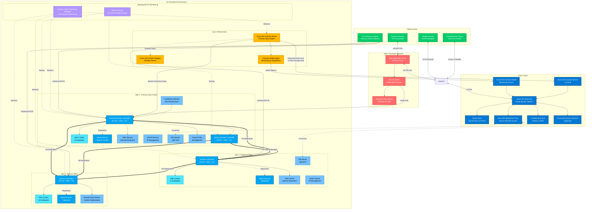

```mermaid
graph TB
    subgraph "Azure Cloud"
        AAD["Azure AD (Entra ID)<br/>Cloud Identity Platform"]
        AADUsers["Cloud Users<br/>Synced from On-Prem"]
        AADConnect["Azure AD Connect Service<br/>in Cloud"]
        AADConnectHealth["Azure AD Connect Health<br/>Monitoring Service"]
        AADAppProxy["Azure AD Application Proxy<br/>Secure Remote Access"]
        ConditionalAccess["Conditional Access<br/>Policies & MFA"]
        AADDomainServices["Azure AD Domain Services<br/>(Optional)"]
        
        AAD --> AADUsers
        AAD --> ConditionalAccess
        AAD --> AADAppProxy
        AAD --> AADDomainServices
        AADConnect --> AAD
        AADConnectHealth --> AAD
    end
    
    subgraph "DMZ / Perimeter Network"
        WAP["Web Application Proxy<br/>Reverse Proxy"]
        ADFS["AD FS Server<br/>Federation Services"]
        NPS["Network Policy Server<br/>RADIUS for MFA"]
        
        WAP --> ADFS
        ADFS --> NPS
    end
    
    subgraph "On-Premises Environment"
        subgraph "Site 1 - Primary Data Center"
            DC1["Primary Domain Controller<br/>AD DS + DNS + GC"]
            DC1Backup["Backup Domain Controller<br/>AD DS + DNS + GC"]
            Site1Users["Site 1 Users<br/>& Computers"]
            Site1RODC["Read-Only DC<br/>(Branch Cache)"]
            CA["Certificate Authority<br/>PKI Infrastructure"]
            DNS1["DNS Servers<br/>Internal Resolution"]
            DHCP1["DHCP Servers<br/>IP Management"]
            FileServer1["File Servers<br/>with DFS"]
            GPO1["Group Policy<br/>Management"]
            
            DC1 --> Site1Users
            DC1 <--> DC1Backup
            DC1 -.Replication.-> Site1RODC
            DC1 --> GPO1
            DC1 --> DNS1
            CA --> DC1
        end
        
        subgraph "Site 2 - Regional Office"
            DC2["Domain Controller<br/>AD DS + DNS + GC"]
            Site2Users["Site 2 Users<br/>& Computers"]
            Site2RODC["Read-Only DC<br/>(Optional)"]
            DNS2["DNS Server<br/>Internal Resolution"]
            DHCP2["DHCP Server<br/>IP Management"]
            FileServer2["File Server<br/>with DFS"]
            
            DC2 --> Site2Users
            DC2 -.Replication.-> Site2RODC
            DC2 --> DNS2
        end
        
        subgraph "Site 3 - Branch Office"
            DC3["Domain Controller<br/>AD DS + DNS + GC"]
            Site3Users["Site 3 Users<br/>& Computers"]
            Site3RODC["Read-Only DC<br/>(Optional)"]
            BranchCache["BranchCache Server<br/>Content Optimization"]
            
            DC3 --> Site3Users
            DC3 -.Replication.-> Site3RODC
            DC3 --> BranchCache
        end
        
        subgraph "Sync Infrastructure"
            SyncServer["Azure AD Connect Server<br/>Primary Sync Engine"]
            SyncStaging["Azure AD Connect Staging<br/>Standby Server"]
            HealthAgent["Connect Health Agent<br/>Monitoring & Diagnostics"]
            
            SyncServer -.Standby Mode.-> SyncStaging
            SyncServer --> HealthAgent
        end
        
        subgraph "Management & Monitoring"
            SCOM["System Center Operations Manager<br/>Infrastructure Monitoring"]
            BackupServer["Backup Server<br/>AD System State Backup"]
        end
    end
    
    subgraph "Client Access"
        OnPremClients["On-Premises Clients<br/>Domain Joined (Hybrid)"]
        CloudClients["Cloud/Remote Clients<br/>Azure AD Joined"]
        MobileDevices["Mobile Devices<br/>Intune Managed"]
        RemoteWorkers["Remote Workers<br/>VPN Connected"]
    end
    
    %% Internet Boundary
    Internet["Internet"]
    
    %% Core AD Replication
    DC1 <==AD Replication==> DC2
    DC2 <==AD Replication==> DC3
    DC3 <==AD Replication==> DC1
    DC1Backup <==AD Replication==> DC2
    DC1Backup <==AD Replication==> DC3
    
    %% Sync to Azure AD
    SyncServer -->|Reads User/Group Data| DC1
    SyncServer -->|Password Hash Sync<br/>or Pass-through Auth| AADConnect
    HealthAgent -->|Health Metrics| AADConnectHealth
    
    %% Federation Flow
    ADFS -->|LDAP Auth| DC1
    WAP <-->|HTTPS 443| Internet
    
    %% Client Authentication Paths
    OnPremClients -->|Kerberos/NTLM| DC1
    OnPremClients -->|Kerberos/NTLM| DC2
    OnPremClients -->|Kerberos/NTLM| DC3
    
    CloudClients <-->|OAuth 2.0/SAML| Internet
    Internet <-->|HTTPS| AAD
    MobileDevices <-->|HTTPS/OAuth| Internet
    RemoteWorkers <-->|VPN/HTTPS| WAP
    
    %% App Proxy Connections
    AADAppProxy <-.Connector.-> FileServer1
    AADAppProxy <-.Connector.-> FileServer2
    
    %% Monitoring Connections
    SCOM -.Monitors.-> DC1
    SCOM -.Monitors.-> DC2
    SCOM -.Monitors.-> DC3
    SCOM -.Monitors.-> SyncServer
    
    BackupServer -.Backup.-> DC1
    BackupServer -.Backup.-> DC1Backup
    
    %% Styling
    classDef azureClass fill:#0078D4,stroke:#004578,stroke-width:2px,color:#fff
    classDef dcClass fill:#00A4EF,stroke:#006BA6,stroke-width:2px,color:#fff
    classDef userClass fill:#50E6FF,stroke:#00B7C3,stroke-width:2px,color:#000
    classDef syncClass fill:#FFB900,stroke:#D39400,stroke-width:2px,color:#000
    classDef clientClass fill:#00CC6A,stroke:#008A4C,stroke-width:2px,color:#fff
    classDef dmzClass fill:#FF6B6B,stroke:#C92A2A,stroke-width:2px,color:#fff
    classDef mgmtClass fill:#B197FC,stroke:#7950F2,stroke-width:2px,color:#fff
    classDef infraClass fill:#74C0FC,stroke:#339AF0,stroke-width:2px,color:#000
    
    class AAD,AADUsers,AADConnect,AADConnectHealth,AADAppProxy,ConditionalAccess,AADDomainServices azureClass
    class DC1,DC2,DC3,DC1Backup,Site1RODC,Site2RODC,Site3RODC dcClass
    class Site1Users,Site2Users,Site3Users userClass
    class SyncServer,SyncStaging,HealthAgent syncClass
    class OnPremClients,CloudClients,MobileDevices,RemoteWorkers clientClass
    class WAP,ADFS,NPS dmzClass
    class SCOM,BackupServer mgmtClass
    class CA,DNS1,DNS2,DHCP1,DHCP2,FileServer1,FileServer2,BranchCache,GPO1 infraClass
```