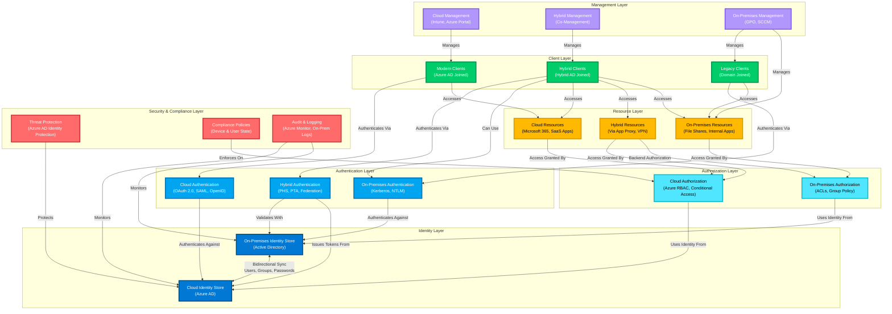

```mermaid
graph TB
    subgraph "Identity Layer"
        CloudIdentity["Cloud Identity Store<br/>(Azure AD)"]
        OnPremIdentity["On-Premises Identity Store<br/>(Active Directory)"]
        
        OnPremIdentity <-->|Bidirectional Sync<br/>Users, Groups, Passwords| CloudIdentity
    end
    
    subgraph "Authentication Layer"
        CloudAuth["Cloud Authentication<br/>(OAuth 2.0, SAML, OpenID)"]
        HybridAuth["Hybrid Authentication<br/>(PHS, PTA, Federation)"]
        OnPremAuth["On-Premises Authentication<br/>(Kerberos, NTLM)"]
        
        CloudAuth -->|Authenticates Against| CloudIdentity
        HybridAuth -->|Validates With| OnPremIdentity
        HybridAuth -->|Issues Tokens From| CloudIdentity
        OnPremAuth -->|Authenticates Against| OnPremIdentity
    end
    
    subgraph "Authorization Layer"
        CloudAuthorization["Cloud Authorization<br/>(Azure RBAC, Conditional Access)"]
        OnPremAuthorization["On-Premises Authorization<br/>(ACLs, Group Policy)"]
        
        CloudAuthorization -->|Uses Identity From| CloudIdentity
        OnPremAuthorization -->|Uses Identity From| OnPremIdentity
    end
    
    subgraph "Resource Layer"
        CloudResources["Cloud Resources<br/>(Microsoft 365, SaaS Apps)"]
        HybridResources["Hybrid Resources<br/>(Via App Proxy, VPN)"]
        OnPremResources["On-Premises Resources<br/>(File Shares, Internal Apps)"]
        
        CloudResources -->|Access Granted By| CloudAuthorization
        HybridResources -->|Access Granted By| CloudAuthorization
        HybridResources -->|Backend Authorization| OnPremAuthorization
        OnPremResources -->|Access Granted By| OnPremAuthorization
    end
    
    subgraph "Client Layer"
        ModernClients["Modern Clients<br/>(Azure AD Joined)"]
        HybridClients["Hybrid Clients<br/>(Hybrid AD Joined)"]
        LegacyClients["Legacy Clients<br/>(Domain Joined)"]
        
        ModernClients -->|Authenticates Via| CloudAuth
        HybridClients -->|Authenticates Via| HybridAuth
        HybridClients -->|Can Use| OnPremAuth
        LegacyClients -->|Authenticates Via| OnPremAuth
    end
    
    subgraph "Management Layer"
        CloudManagement["Cloud Management<br/>(Intune, Azure Portal)"]
        HybridManagement["Hybrid Management<br/>(Co-Management)"]
        OnPremManagement["On-Premises Management<br/>(GPO, SCCM)"]
        
        CloudManagement -->|Manages| ModernClients
        HybridManagement -->|Manages| HybridClients
        OnPremManagement -->|Manages| LegacyClients
        OnPremManagement -->|Manages| OnPremResources
    end
    
    subgraph "Security & Compliance Layer"
        ThreatProtection["Threat Protection<br/>(Azure AD Identity Protection)"]
        CompliancePolicy["Compliance Policies<br/>(Device & User State)"]
        AuditLogging["Audit & Logging<br/>(Azure Monitor, On-Prem Logs)"]
        
        ThreatProtection -->|Protects| CloudIdentity
        CompliancePolicy -->|Enforces On| CloudAuthorization
        AuditLogging -->|Monitors| CloudIdentity
        AuditLogging -->|Monitors| OnPremIdentity
    end
    
    %% Cross-layer connections
    ModernClients -->|Accesses| CloudResources
    HybridClients -->|Accesses| CloudResources
    HybridClients -->|Accesses| HybridResources
    HybridClients -->|Accesses| OnPremResources
    LegacyClients -->|Accesses| OnPremResources
    
    %% Styling
    classDef identityClass fill:#0078D4,stroke:#004578,stroke-width:3px,color:#fff
    classDef authClass fill:#00A4EF,stroke:#006BA6,stroke-width:3px,color:#fff
    classDef authzClass fill:#50E6FF,stroke:#00B7C3,stroke-width:3px,color:#000
    classDef resourceClass fill:#FFB900,stroke:#D39400,stroke-width:3px,color:#000
    classDef clientClass fill:#00CC6A,stroke:#008A4C,stroke-width:3px,color:#fff
    classDef mgmtClass fill:#B197FC,stroke:#7950F2,stroke-width:3px,color:#fff
    classDef secClass fill:#FF6B6B,stroke:#C92A2A,stroke-width:3px,color:#fff
    
    class CloudIdentity,OnPremIdentity identityClass
    class CloudAuth,HybridAuth,OnPremAuth authClass
    class CloudAuthorization,OnPremAuthorization authzClass
    class CloudResources,HybridResources,OnPremResources resourceClass
    class ModernClients,HybridClients,LegacyClients clientClass
    class CloudManagement,HybridManagement,OnPremManagement mgmtClass
    class ThreatProtection,CompliancePolicy,AuditLogging secClass
```