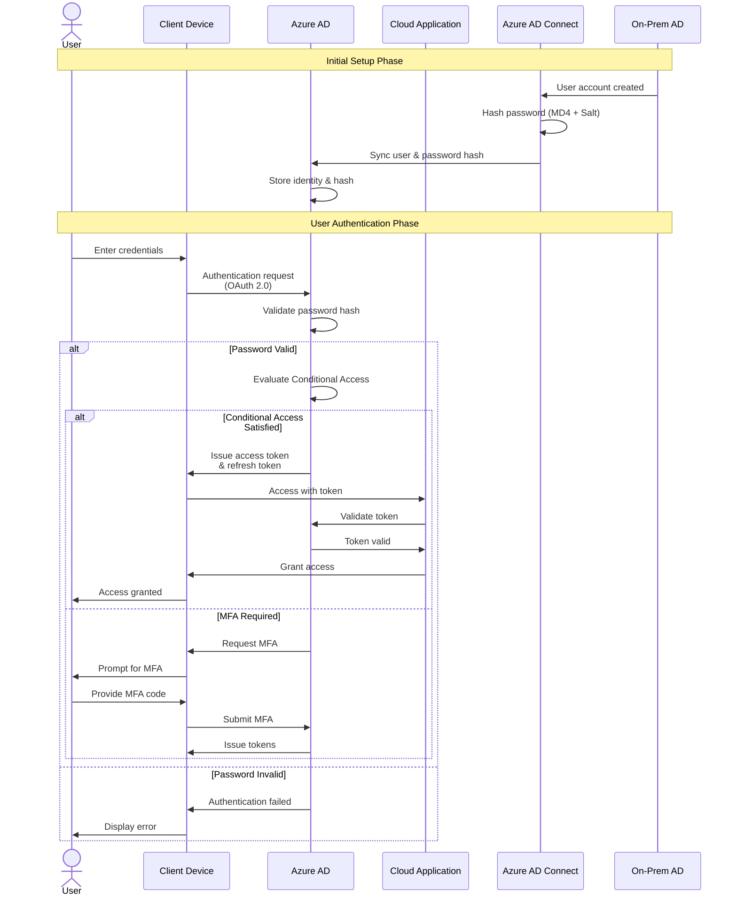

### User Authentication Workflow (Password Hash Sync)

```mermaid
sequenceDiagram
    actor User
    participant Client as Client Device
    participant AAD as Azure AD
    participant App as Cloud Application
    participant ADConnect as Azure AD Connect
    participant OnPremAD as On-Prem AD
    
    Note over User,OnPremAD: Initial Setup Phase
    OnPremAD->>ADConnect: User account created
    ADConnect->>ADConnect: Hash password (MD4 + Salt)
    ADConnect->>AAD: Sync user & password hash
    AAD->>AAD: Store identity & hash
    
    Note over User,OnPremAD: User Authentication Phase
    User->>Client: Enter credentials
    Client->>AAD: Authentication request<br/>(OAuth 2.0)
    AAD->>AAD: Validate password hash
    
    alt Password Valid
        AAD->>AAD: Evaluate Conditional Access
        alt Conditional Access Satisfied
            AAD->>Client: Issue access token<br/>& refresh token
            Client->>App: Access with token
            App->>AAD: Validate token
            AAD->>App: Token valid
            App->>Client: Grant access
            Client->>User: Access granted
        else MFA Required
            AAD->>Client: Request MFA
            Client->>User: Prompt for MFA
            User->>Client: Provide MFA code
            Client->>AAD: Submit MFA
            AAD->>Client: Issue tokens
        end
    else Password Invalid
        AAD->>Client: Authentication failed
        Client->>User: Display error
    end
```