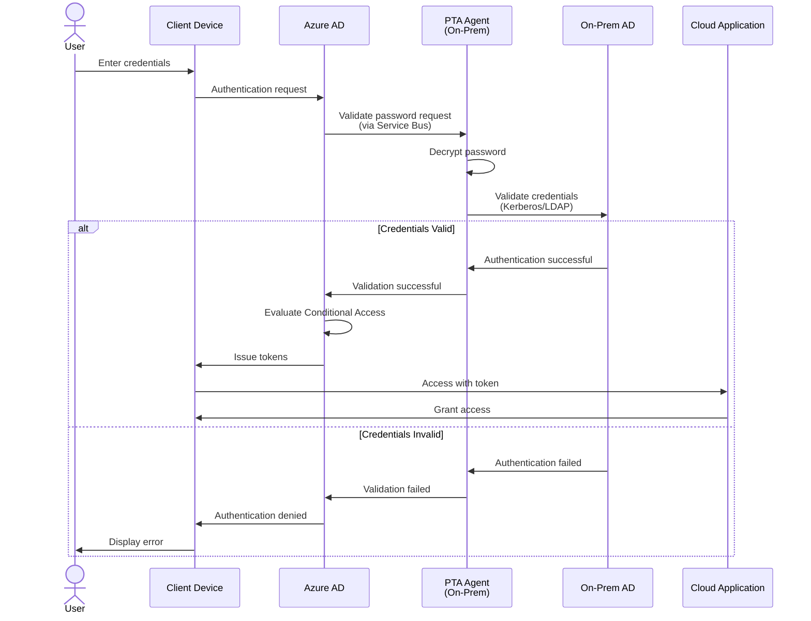

### Pass-Through Authentication Workflow

```mermaid
sequenceDiagram
    actor User
    participant Client as Client Device
    participant AAD as Azure AD
    participant PTAAgent as PTA Agent<br/>(On-Prem)
    participant OnPremAD as On-Prem AD
    participant App as Cloud Application
    
    User->>Client: Enter credentials
    Client->>AAD: Authentication request
    AAD->>PTAAgent: Validate password request<br/>(via Service Bus)
    PTAAgent->>PTAAgent: Decrypt password
    PTAAgent->>OnPremAD: Validate credentials<br/>(Kerberos/LDAP)
    
    alt Credentials Valid
        OnPremAD->>PTAAgent: Authentication successful
        PTAAgent->>AAD: Validation successful
        AAD->>AAD: Evaluate Conditional Access
        AAD->>Client: Issue tokens
        Client->>App: Access with token
        App->>Client: Grant access
    else Credentials Invalid
        OnPremAD->>PTAAgent: Authentication failed
        PTAAgent->>AAD: Validation failed
        AAD->>Client: Authentication denied
        Client->>User: Display error
    end
```