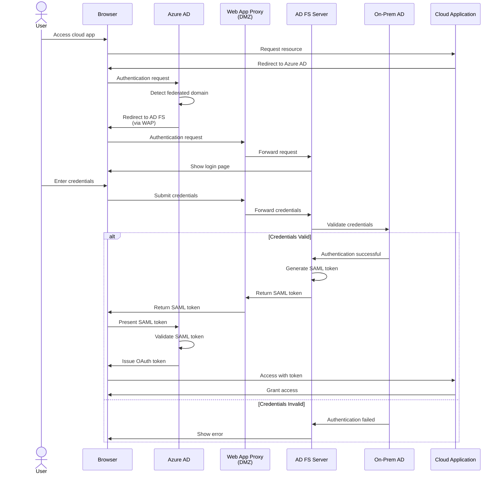

### Federation (AD FS) Workflow

```mermaid
sequenceDiagram
    actor User
    participant Browser as Browser
    participant AAD as Azure AD
    participant WAP as Web App Proxy<br/>(DMZ)
    participant ADFS as AD FS Server
    participant OnPremAD as On-Prem AD
    participant App as Cloud Application
    
    User->>Browser: Access cloud app
    Browser->>App: Request resource
    App->>Browser: Redirect to Azure AD
    Browser->>AAD: Authentication request
    AAD->>AAD: Detect federated domain
    AAD->>Browser: Redirect to AD FS<br/>(via WAP)
    Browser->>WAP: Authentication request
    WAP->>ADFS: Forward request
    ADFS->>Browser: Show login page
    User->>Browser: Enter credentials
    Browser->>WAP: Submit credentials
    WAP->>ADFS: Forward credentials
    ADFS->>OnPremAD: Validate credentials
    
    alt Credentials Valid
        OnPremAD->>ADFS: Authentication successful
        ADFS->>ADFS: Generate SAML token
        ADFS->>WAP: Return SAML token
        WAP->>Browser: Return SAML token
        Browser->>AAD: Present SAML token
        AAD->>AAD: Validate SAML token
        AAD->>Browser: Issue OAuth token
        Browser->>App: Access with token
        App->>Browser: Grant access
    else Credentials Invalid
        OnPremAD->>ADFS: Authentication failed
        ADFS->>Browser: Show error
    end
```