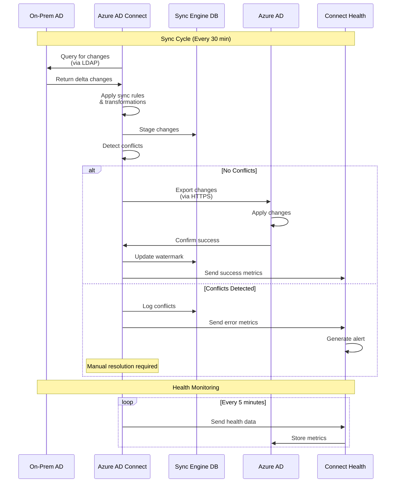

### Azure AD Connect Synchronization Workflow

```mermaid
sequenceDiagram
    participant OnPremAD as On-Prem AD
    participant ADConnect as Azure AD Connect
    participant LocalDB as Sync Engine DB
    participant AAD as Azure AD
    participant Health as Connect Health
    
    Note over OnPremAD,Health: Sync Cycle (Every 30 min)
    
    ADConnect->>OnPremAD: Query for changes<br/>(via LDAP)
    OnPremAD->>ADConnect: Return delta changes
    
    ADConnect->>ADConnect: Apply sync rules<br/>& transformations
    ADConnect->>LocalDB: Stage changes
    
    ADConnect->>ADConnect: Detect conflicts
    
    alt No Conflicts
        ADConnect->>AAD: Export changes<br/>(via HTTPS)
        AAD->>AAD: Apply changes
        AAD->>ADConnect: Confirm success
        ADConnect->>LocalDB: Update watermark
        ADConnect->>Health: Send success metrics
    else Conflicts Detected
        ADConnect->>LocalDB: Log conflicts
        ADConnect->>Health: Send error metrics
        Health->>Health: Generate alert
        Note over ADConnect: Manual resolution required
    end
    
    Note over OnPremAD,Health: Health Monitoring
    loop Every 5 minutes
        ADConnect->>Health: Send health data
        Health->>AAD: Store metrics
    end
```