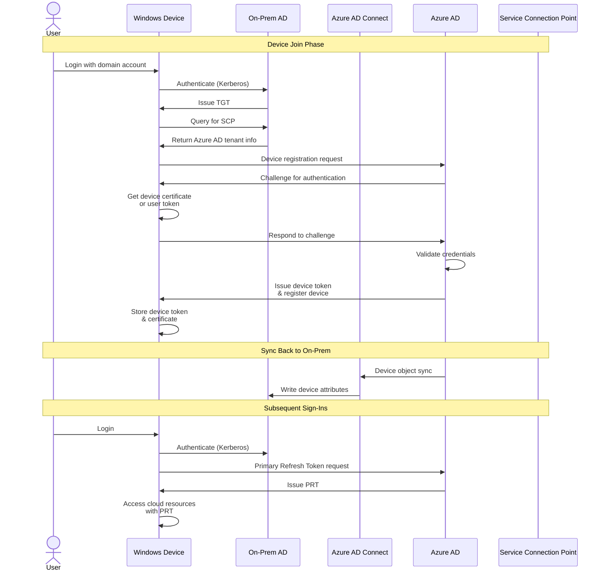

### Hybrid Azure AD Join Workflow

```mermaid
sequenceDiagram
    actor User
    participant Device as Windows Device
    participant OnPremAD as On-Prem AD
    participant ADConnect as Azure AD Connect
    participant AAD as Azure AD
    participant SCP as Service Connection Point
    
    Note over User,SCP: Device Join Phase
    
    User->>Device: Login with domain account
    Device->>OnPremAD: Authenticate (Kerberos)
    OnPremAD->>Device: Issue TGT
    
    Device->>OnPremAD: Query for SCP
    OnPremAD->>Device: Return Azure AD tenant info
    
    Device->>AAD: Device registration request
    AAD->>Device: Challenge for authentication
    Device->>Device: Get device certificate<br/>or user token
    Device->>AAD: Respond to challenge
    
    AAD->>AAD: Validate credentials
    AAD->>Device: Issue device token<br/>& register device
    Device->>Device: Store device token<br/>& certificate
    
    Note over User,SCP: Sync Back to On-Prem
    
    AAD->>ADConnect: Device object sync
    ADConnect->>OnPremAD: Write device attributes
    
    Note over User,SCP: Subsequent Sign-Ins
    
    User->>Device: Login
    Device->>OnPremAD: Authenticate (Kerberos)
    Device->>AAD: Primary Refresh Token request
    AAD->>Device: Issue PRT
    Device->>Device: Access cloud resources<br/>with PRT
```