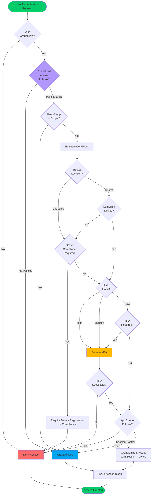

### Conditional Access Evaluation Workflow

```mermaid
flowchart TD
    Start([User Authentication Request]) --> ValidateCreds{Valid<br/>Credentials?}
    
    ValidateCreds -->|No| Deny[Deny Access]
    ValidateCreds -->|Yes| CheckCA{Conditional<br/>Access<br/>Policies?}
    
    CheckCA -->|No Policies| GrantAccess[Grant Access]
    CheckCA -->|Policies Exist| EvalUser{User/Group<br/>in Scope?}
    
    EvalUser -->|No| GrantAccess
    EvalUser -->|Yes| EvalConditions[Evaluate Conditions]
    
    EvalConditions --> CheckLocation{Trusted<br/>Location?}
    CheckLocation -->|Untrusted| CheckDeviceComp
    CheckLocation -->|Trusted| CheckDevice
    
    CheckDevice{Compliant<br/>Device?} -->|No| CheckDeviceComp
    CheckDevice -->|Yes| CheckRisk
    
    CheckDeviceComp{Device<br/>Compliance<br/>Required?} -->|Yes| RequireCompliance[Require Device Registration<br/>or Compliance]
    CheckDeviceComp -->|No| CheckRisk
    
    RequireCompliance --> Deny
    
    CheckRisk{Risk<br/>Level?} -->|High| RequireMFA
    CheckRisk -->|Medium| RequireMFA
    CheckRisk -->|Low| CheckMFAPolicy
    
    CheckMFAPolicy{MFA<br/>Required?} -->|Yes| RequireMFA[Require MFA]
    CheckMFAPolicy -->|No| CheckAppControl
    
    RequireMFA --> MFASuccess{MFA<br/>Successful?}
    MFASuccess -->|No| Deny
    MFASuccess -->|Yes| CheckAppControl
    
    CheckAppControl{App Control<br/>Policies?} -->|Block| Deny
    CheckAppControl -->|Session Control| LimitedAccess[Grant Limited Access<br/>with Session Policies]
    CheckAppControl -->|None| GrantAccess
    
    GrantAccess --> IssueToken[Issue Access Token]
    LimitedAccess --> IssueToken
    
    IssueToken --> End([Access Granted])
    Deny --> End
    
    style Start fill:#00CC6A
    style End fill:#00CC6A
    style Deny fill:#FF6B6B
    style GrantAccess fill:#00A4EF
    style RequireMFA fill:#FFB900
    style CheckCA fill:#B197FC
```