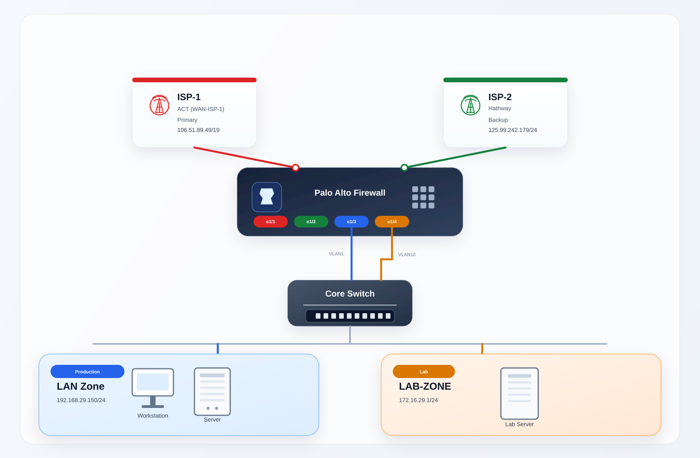

# Enterprise Network Architecture - Executive View

This version keeps the same logical topology as the original diagram, but presents it in a cleaner executive-review format with clearer tiers, stronger visual hierarchy, and network-specific device styling.

## Included topology

- Internet connectivity through `ISP-1` (`WAN-ISP-1`, `106.51.89.49/19`) and `ISP-2` (`125.99.242.179/24`)
- Palo Alto firewall as the security boundary
- Core switch receiving segmented handoff from the firewall
- Production LAN on `VLAN1` with `192.168.29.150/24`
- Lab environment on `VLAN10` with `172.16.29.1/24`
