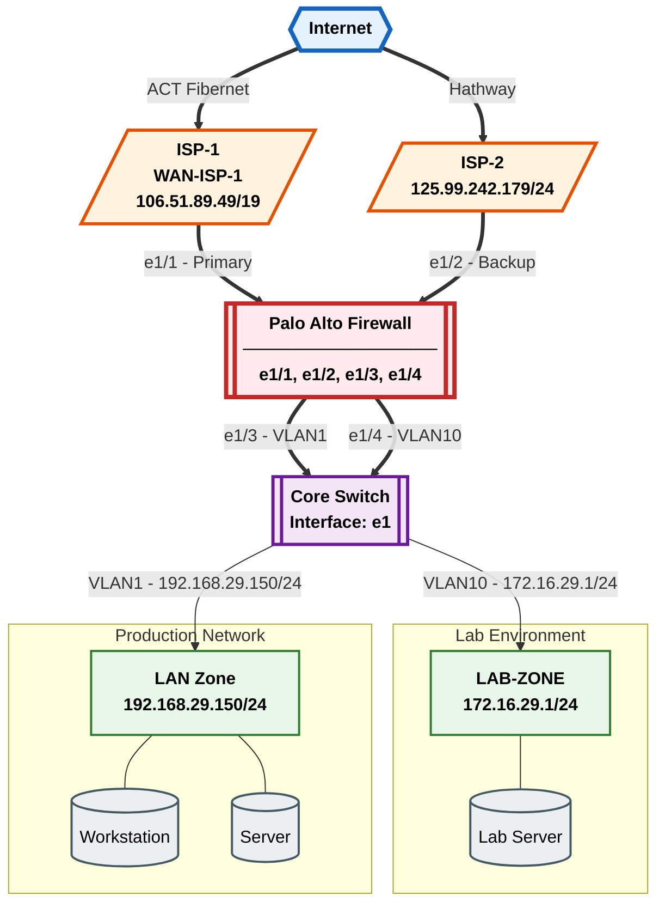

# Enterprise Network Architecture

```mermaid
flowchart TB
    linkStyle default interpolate basis
    Internet{{Internet}}
    
    ISP1[/"ISP-1<br/>WAN-ISP-1<br/>106.51.89.49/19"/]
    ISP2[/"ISP-2<br/>125.99.242.179/24"/]
    
    Firewall[["Palo Alto Firewall<br/>────────────────<br/>e1/1, e1/2, e1/3, e1/4"]]
    
    Switch[["Core Switch<br/>Interface: e1"]]
    
    subgraph Lab["Lab Environment"]
        LabZone["LAB-ZONE<br/>172.16.29.1/24"]
        LabServer[("Lab Server")]
    end
    
    subgraph Production["Production Network"]
        LAN["LAN Zone<br/>192.168.29.150/24"]
        PC1[("Workstation")]
        Server[("Server")]
    end
    
    Internet ==>|ACT Fibernet| ISP1
    Internet ==>|Hathway| ISP2
    
    ISP1 ==>|e1/1 - Primary| Firewall
    ISP2 ==>|e1/2 - Backup| Firewall
    
    Firewall ==>|e1/3 - VLAN1| Switch
    Firewall ==>|e1/4 - VLAN10| Switch
    
    Switch -->|VLAN10 - 172.16.29.1/24| LabZone
    Switch -->|VLAN1 - 192.168.29.150/24| LAN
    LabZone --- LabServer
    LAN --- PC1
    LAN --- Server
    
    classDef internetClass fill:#E3F2FD,stroke:#1565C0,stroke-width:4px,color:#000,font-weight:bold
    classDef ispClass fill:#FFF3E0,stroke:#E65100,stroke-width:3px,color:#000,font-weight:bold
    classDef firewallClass fill:#FFEBEE,stroke:#C62828,stroke-width:4px,color:#000,font-weight:bold
    classDef switchClass fill:#F3E5F5,stroke:#6A1B9A,stroke-width:3px,color:#000,font-weight:bold
    classDef networkClass fill:#E8F5E9,stroke:#2E7D32,stroke-width:2px,color:#000,font-weight:bold
    classDef deviceClass fill:#ECEFF1,stroke:#455A64,stroke-width:2px,color:#000
    
    class Internet internetClass
    class ISP1,ISP2 ispClass
    class Firewall firewallClass
    class Switch switchClass
    class LAN,LabZone networkClass
    class PC1,Server,LabServer deviceClass
```
